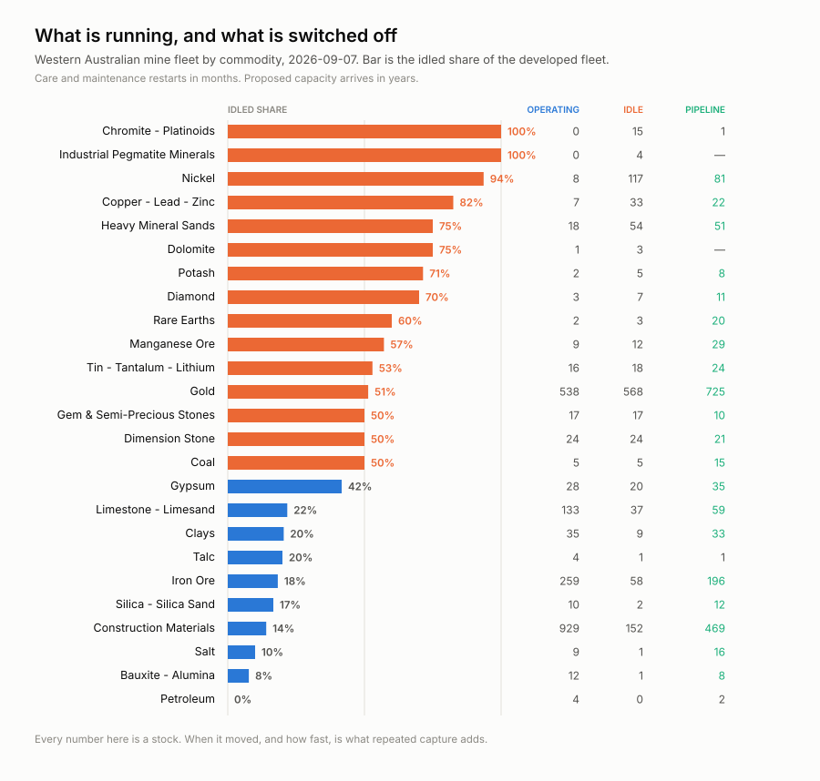
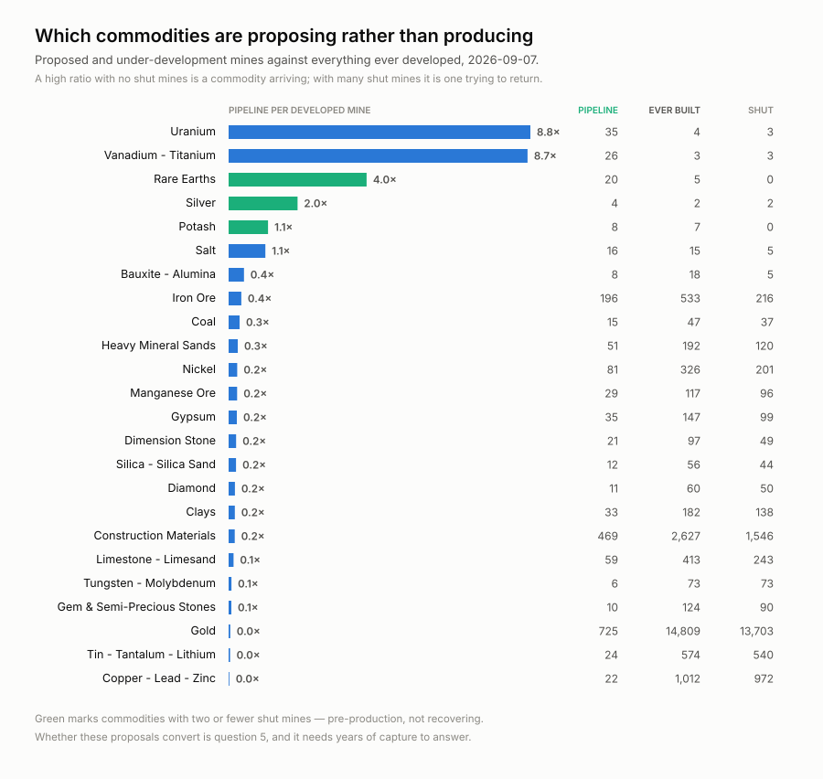
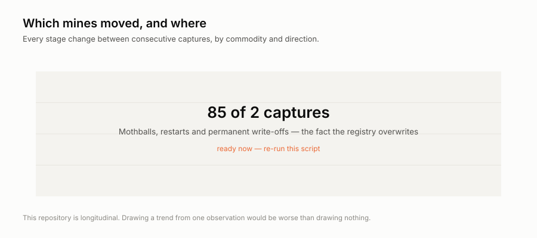

<h1 align="center">wss-mining-pipeline</h1>

<p align="center">
  <strong>When Western Australian mines switch off — and when they come back</strong>
</p>

<div align="center">

  <a href="https://github.com/q3dresearch/wss-mining-pipeline/actions/workflows/capture-monthly.yml"></a>
  <a href="https://github.com/q3dresearch/wss-mining-pipeline/commits"></a>
  <a href="https://github.com/q3dresearch/wss-mining-pipeline/blob/main/LICENSE"></a>
  <a href="https://github.com/q3dresearch/wss-mining-pipeline"></a>

</div>

<p align="center">
  <sub>fleet: <a href="https://github.com/q3dresearch/wss-engine">engine</a> · <a href="https://github.com/q3dresearch/wss-hugging-face">hugging face</a> · <a href="https://github.com/q3dresearch/wss-openrouter">openrouter</a> · <a href="https://github.com/q3dresearch/wss-cloud-footprint">cloud footprint</a> · <strong>mining</strong> · <a href="https://github.com/q3dresearch/wss-forest-harvest">forest</a> · <a href="https://github.com/q3dresearch/wss-food-trace">food</a></sub>
</p>

Western Australia publishes the current state of **48,414 mine sites**. The
service has no `timeInfo`, no historic-moment support and no dated snapshots —
when a mine moves from *Operating* to *Care and Maintenance*, the old value is
overwritten and nothing records when it happened.

**The first two captures already proved the point.** On 3 September 2026 the
layer went from 10,004 rows to 48,414 in a single refresh, and every `gid` was
reassigned. Nobody announced it, and the earlier state is now unobtainable from
the service — except that this archive holds it. The truncation gate caught the
change by failing the capture loudly rather than silently keeping a fifth of
the data; see [pagination](docs/pagination.md).

That date is the whole point. Idled capacity restarts in months, so knowing
**when** a commodity's fleet went dark, and how fast, is a supply signal no
single download can give you.

## What it shows today



Nickel runs **8** mines against 117 mothballed — 94% of its developed fleet is
switched off. Even gold, at 538 operating, has 568 idled. Across the state:
**2,077 operating against 1,169 in care and maintenance**, and 18,721 shut
for good.



Chromite-platinoids and industrial pegmatite minerals have **no operating
mines at all** — every developed site is idle. Rare earths run 2 against 20
proposed, the strongest forward pipeline relative to what exists.

## What it cannot show yet



Two of the four charts render as placeholders naming what they need. Re-run
[`examples/visualize.py`](examples/visualize.py) after any capture and they
fill in by themselves. Inventing a trend from one observation would be worse
than drawing nothing.

## Should you fork this?

**Yes, if** you want a dated record of when WA mines change state — supply
modelling, critical-minerals work, or a worked example of capturing a registry
that overwrites itself.

**No, if** you need any of these, because it will never have them:

| you need | status |
| --- | --- |
| Why a mine was mothballed | **never** — `site_stage` has no reason code |
| Production, employment, reserves, capex | **never** — not in MINEDEX |
| Prices, or lead/lag against them | cite a price series; this fleet does not capture prices |
| Who owns the ground | [blocked on a personal-data decision](docs/ownership-is-blocked.md) |
| Anywhere outside Western Australia | [Brazil is scoped and blocked](docs/pagination.md) |
| History before September 2026 | impossible — nobody kept it |

**Cost to run:** one Actions job a month, 3 polite GETs against one government
host, roughly **12 MB raw and 36 MB derived per year**. No key, no account, an
open licence.

**Prior art, honestly:** S&P Global, Wood Mackenzie and CRU all sell mine-status
data, and WA publishes its own *Operating Mines* extract — which excludes care
and maintenance and is overwritten in place. The narrow gap this fills is a
free, machine-readable **time series** of the transitions. See
[research questions](docs/research-questions.md).

## How it works

One metric is kept: **`stage`** on `site:wa:<site_code>`. `commodity` and
`site_type` ride alongside, because a stage change is unreadable without
knowing what the site produces. Site coordinates go to the raw archive but not
the observation table — they exist only to make a later spatial join possible.

Long format throughout: one row per `entity_id` × `metric` × `observed_at`.
`observed_at` is the **service's own extract stamp**, not the fetch time, so a
re-capture of an unchanged month restates rather than duplicates. Deduplicate
on `(entity_id, metric, observed_at)` taking the newest `captured_at`.

**Monthly, on the 3rd.** Care-and-maintenance decisions are board decisions
measured in quarters; weekly would cost four times the storage for no extra
resolution. `derive` follows on the 4th and writes **what moved** into the
workflow summary, so a quiet month reads as an explicit no-op rather than
silence.

**Completeness is asserted, not assumed.** The service caps a response at
10,000 features and says so in the payload, with HTTP 200. Endpoints are
`gid`-range partitions sized well under that cap, and a gate fails the capture
if any response reports truncation — [pagination](docs/pagination.md).

## What is excluded, and why

| | |
| --- | --- |
| [what we do not capture](docs/what-we-do-not-capture.md) | WA's 422,194 dead tenements back to 1883, its exploration reports, and British Columbia — all keep their own history, so they are cited, not mirrored |
| [ownership is blocked](docs/ownership-is-blocked.md) | the tenement source is written and **paused**: 40% of holders are named individuals and this fleet declares `personal_data: none` |
| [pagination](docs/pagination.md) | why Brazil's 269,427 active processes belong here and cannot be captured yet |
| [research questions](docs/research-questions.md) | the six answerable questions, and the limits above in full |

## Run it locally

```bash
python -m venv .venv && . .venv/bin/activate
pip install -r requirements.txt
export WSS_CONTACT="you or your repo URL"   # identifies you to publishers

wss validate
wss doctor wa.minedex.sites                 # read the raw response before trusting it
wss capture --cadence monthly && wss derive

python examples/load_observations.py        # sqlite + examples/queries.sql
python examples/visualize.py                # redraw examples/charts/
python examples/whats_changed.py            # what moved since the previous capture
```

`wss sources` regenerates [SOURCES.md](SOURCES.md) — every endpoint, its
licence, and its last stored capture.

## Going live

1. Push this repo **and the engine** under the same owner: the workflows
   install from `github.com/<owner>/wss-engine` at a pinned tag.
2. Set the repo secret **`WSS_CONTACT`** — capture refuses to run without it.
3. Run `capture-monthly` by hand once (Actions → capture-monthly → Run
   workflow), confirm the bot's data commit lands, then let the cron take over.

No workflow ever names a source: capture shards whatever `registry/` marks
active, so infrastructure never changes when sources do. The bot commits data
only — the one config it may touch is flipping a repeatedly-failing source to
`auto_disabled`, with an issue explaining why.

## Licences

Code is MIT ([LICENSE](LICENSE)); data in `raw/`, `manifest/` and `derived/` is
CC-BY-4.0 ([LICENSE-DATA](LICENSE-DATA)), citation in
[CITATION.cff](CITATION.cff). Captured content remains subject to the
publisher's own terms.

Topics: `git-scraping` · `open-data` · `point-in-time-data` · `mining` · `dataset`
